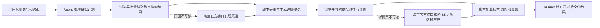

# 淘宝商品查价与风险研究

## 这个仓库能做什么

这个仓库维护 `$taobao-price-research` Skill

用户提出淘宝查价请求后，Skill 会生成多个搜索词、批量收集候选商品、读取入围详情、核验目标规格、分析店铺与评价风险，并找出最低价可行商品

Skill 只执行读取和分析

它不会自动下单、联系卖家、收藏、关注、领券、加购或绕过登录验证

## 一次任务怎样运行



搜索结果卡片只能发现候选

具体商品页确认目标 SKU 后才能成为 A 级价格证据

最终 validator 会重新核对赢家是否为同组可行商品中的最低可比价格

## 当前采集范围

默认研究预算：

- 生成 2 至 4 个搜索词 —— 降低单一关键词漏查
- 每个搜索词读取 1 至 3 页 —— 控制速度和页面压力
- 最多收集 80 个候选商品 —— 防止无界采集
- 最多核验 20 个详情页 —— 把时间集中在低价入围商品
- 最多深入读取 8 个商品的评价信号 —— 优先核查最终候选

每次实际预算由入口研究计划声明，并且不能超过工作流上限

## 当前实测状态

确定性流程、外部节点提交、登录暂停、去重、详情证据校验、风险排名和最终赢家复算已经通过自动测试

2026-07-24 的两次真实运行中，当前 Codex 浏览器安全策略分别禁止访问淘宝搜索页和淘宝首页

这次阻止发生在淘宝页面加载和登录之前

用户是否已经登录不会改变这个宿主策略结果

Runner 会先进入淘宝开放平台只读接口

用户尚未配置官方接口凭据时，Runner 再进入人工核验回退，返回官方淘宝搜索入口、明确标注未取得实时价格，并拒绝宣布最低价赢家

这个限制来自当前宿主浏览器策略

Skill 不会通过切换隐蔽工具、读取浏览器数据或使用搜索摘要绕过限制

在允许淘宝访问并由用户亲自完成登录的宿主中，继续执行正常搜索和详情节点

## 官方接口怎样接入

本版已经接入以下两个淘宝开放平台只读接口：

- `taobao.tbk.dg.material.optional.upgrade` —— 浏览器搜索失败后发现候选商品
- `taobao.tbk.item.details.upgrade.get` —— 浏览器详情失败后核验 SKU 价格、库存、邮费和图片

它们需要用户自己的 `App Key`、`App Secret` 和淘宝客推广位编号

它们只覆盖淘宝客可推广商品，不能代表淘宝全部在售商品

它们不提供评价正文、完整退货条件和完整保修信息

Skill 会把这些限制写进覆盖缺口，不会把淘宝客结果包装成全站最低价真值

完整准备步骤位于 [淘宝官方接口接入](.agents/skills/taobao-price-research/references/official-api.md)

官方资料：

- [淘宝客物料搜索升级版](https://developer.alibaba.com/docs/api.htm?apiId=64759)
- [淘宝客商品详情升级版](https://developer.alibaba.com/docs/api.htm?apiId=64757)
- [淘宝开放平台调用与签名规则](https://developer.alibaba.com/docs/doc.htm.htm?articleId=101617&docType=1&treeId=1)
- [淘宝开放平台新手指南](https://developer.alibaba.com/docs/doc.htm?articleId=118395&docType=1&source=search&treeId=1)

## 最终结果包含什么

- 查询时间、收货城市级地区、目标规格、成色和会员假设
- 商品价、运费、已验证优惠和已知总额
- 店铺名称、店铺类型、评分、目标 SKU 和库存
- 宣传图、评价负面主题、退货与保修信息
- 风险分、风险理由、排除理由和商品直达链接
- 最低价可行商品或没有可行商品的明确结论
- 搜索词、读取页数、候选数量、详情核验数量和覆盖缺口

## 怎样使用

先在本机创建 Codex Skill 链接：

```bash
python3 scripts/install_local.py
```

安装器把 `~/.codex/skills/taobao-price-research` 链接到当前仓库中的真实 Skill 目录

符号链接让 Codex 能够发现 Skill，同时保留 Runner 需要的核心锁、版本、学习目录和运行状态目录

安装器不会覆盖已经存在的路径

移动或删除当前仓库会使链接失效

安装完成后，Skill 会在 Codex 的下一轮任务中可用

把自然语言请求转换成入口 JSON

示例：

```json
{
  "request_text": "搜索淘宝上全新的 RTX 5070 Ti 16GB 显卡 排除配件 定金 预售 二手和明显高风险店铺 找出最便宜的可行商品",
  "destination_region": "上海",
  "membership_notes": "无已知会员权益"
}
```

启动 Runner：

```bash
python3 .agents/skills/taobao-price-research/scripts/runner.py start --input input.json
```

按照 Runner 返回的 `next_command` 推进

外部节点成功时使用 `submit`

登录或验证码需要用户操作时使用 `fail --kind user-required`

宿主策略禁止页面访问时使用 `fail --kind policy-blocked`

Runner 会自动尝试工作流中声明的淘宝官方接口节点

官方接口凭据只能通过本机环境变量提供

只有 `status=completed` 才表示最终结果通过机器检查

完整 Agent 协议位于 [SKILL.md](.agents/skills/taobao-price-research/SKILL.md)

## 维护者怎样验证

依次运行：

```bash
python3 scripts/validate.py --ignore-core-lock
python3 -m unittest discover -s tests -v
python3 scripts/check_secrets.py
python3 .agents/skills/taobao-price-research/scripts/freeze_core.py
python3 scripts/validate.py
python3 .agents/skills/taobao-price-research/scripts/freeze_core.py --check
```

测试覆盖正常完成、去重、排除错误商品、优惠计算、风险排名、虚假赢家拒绝、登录暂停、策略阻止回退、官方签名、官方响应规范化、凭据缺失回退和本地安装

## 人工审计顺序

1. 阅读本页 —— 先理解目标、边界和完整流程
2. 阅读 `SKILL.md` —— 核对 Agent 必须遵守的运行协议
3. 阅读 `workflow.yaml` —— 核对节点、执行器、预算、失败和回退路径
4. 阅读 `references/browser-collection.md` —— 核对页面采集字段与登录边界
5. 阅读 `references/official-api.md` —— 核对官方接口能力 凭据位置和覆盖缺口
6. 阅读 `references/risk-ranking.md` —— 核对风险分、成本公式和赢家规则
7. 阅读 `schemas/` —— 核对每个阶段允许提交的数据
8. 阅读领域脚本 —— 核对去重、官方接口、详情校验、成本计算和最终复算
9. 阅读 `tests/test_taobao_domain.py` —— 用具体案例确认规则真的生效
10. 阅读 `SECURITY.md` —— 最后核对凭据、隐私和外部副作用

完成这个顺序后，你能够理解一次淘宝查价怎样从用户请求变成可复核结论
