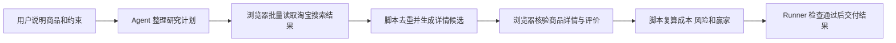

# 淘宝商品查价与风险研究

## 这个仓库能做什么

这个仓库维护 `$taobao-price-research` Skill

用户提出淘宝查价请求后，Skill 会生成多个搜索词、批量收集候选商品、读取入围详情、核验目标规格、分析店铺与评价风险，并找出最低价可行商品

Skill 只执行读取和分析

它不会自动下单、联系卖家、收藏、关注、领券、加购或绕过登录验证

## 一次任务怎样运行



搜索结果卡片只能发现候选

具体商品页确认目标 SKU 后才能成为 A 级价格证据

最终 validator 会重新核对赢家是否为同组可行商品中的最低可比价格

## 当前采集范围

默认研究预算：

- 生成 2 至 4 个搜索词 —— 降低单一关键词漏查
- 每个搜索词读取 1 至 3 页 —— 控制速度和页面压力
- 最多收集 80 个候选商品 —— 防止无界采集
- 最多核验 20 个详情页 —— 把时间集中在低价入围商品
- 最多深入读取 8 个商品的评价信号 —— 优先核查最终候选

每次实际预算由入口研究计划声明，并且不能超过工作流上限

## 当前实测状态

确定性流程、外部节点提交、登录暂停、去重、详情证据校验、风险排名和最终赢家复算已经通过自动测试

2026-07-24 的真实运行中，内置 Codex 浏览器安全策略分别禁止访问淘宝搜索页和淘宝首页

2026-07-27 已经建立并安装独立的 `AIALRA Shopping Browser` 插件

插件固定使用微软官方 Playwright MCP，通过仓库外的独立持久 Chrome 资料保存用户亲自建立的登录状态

本地端到端测试已经验证 MCP 能启动 Chrome、打开测试商品页并读取商品与价格

真实淘宝访问必须在安装插件后创建的新任务中重新预检

旧任务已经命中 `policy-blocked` 时仍然直接结束，不能在同一次任务中切换工具

新任务只有实际加载 `aialra-shopping-browser` MCP 后才能使用本方案

## 怎样准备购物浏览器

1. 安装 `aialra-shopping-browser@personal`
2. 新建一个 Codex 任务
3. 确认新任务已经加载 `aialra-shopping-browser` MCP
4. 让 Skill 打开淘宝并完成真实搜索预检
5. 页面要求登录、扫码或验证码时由用户在独立 Chrome 中亲自完成
6. 用户完成后从当前页面继续

插件不连接日常 Chrome，不读取密码库、历史记录或其他标签页

独立资料默认保存在

```text
~/Library/Application Support/AIALRA Shopping Browser/Profile
```

这个目录位于仓库外，不能提交到 Git

## 最终结果包含什么

- 查询时间、收货城市级地区、目标规格、成色和会员假设
- 商品价、运费、已验证优惠和已知总额
- 店铺名称、店铺类型、评分、目标 SKU 和库存
- 宣传图、评价负面主题、退货与保修信息
- 风险分、风险理由、排除理由和商品直达链接
- 最低价可行商品或没有可行商品的明确结论
- 搜索词、读取页数、候选数量、详情核验数量和覆盖缺口

## 怎样使用

先在本机创建 Codex Skill 链接：

```bash
python3 scripts/install_local.py
```

安装器把 `~/.codex/skills/taobao-price-research` 链接到当前仓库中的真实 Skill 目录

符号链接让 Codex 能够发现 Skill，同时保留 Runner 需要的核心锁、版本、学习目录和运行状态目录

安装器不会覆盖已经存在的路径

移动或删除当前仓库会使链接失效

安装完成后，Skill 会在 Codex 的下一轮任务中可用

把自然语言请求转换成入口 JSON

示例：

```json
{
  "request_text": "搜索淘宝上全新的 RTX 5070 Ti 16GB 显卡 排除配件 定金 预售 二手和明显高风险店铺 找出最便宜的可行商品",
  "destination_region": "上海",
  "membership_notes": "无已知会员权益"
}
```

启动 Runner：

```bash
python3 .agents/skills/taobao-price-research/scripts/runner.py start --input input.json
```

按照 Runner 返回的 `next_command` 推进

外部节点成功时使用 `submit`

登录或验证码需要用户操作时使用 `fail --kind user-required`

宿主策略禁止页面访问时使用 `fail --kind policy-blocked`

Runner 会直接结束为 `failed`

只有 `status=completed` 才表示最终结果通过机器检查

完整 Agent 协议位于 [SKILL.md](.agents/skills/taobao-price-research/SKILL.md)

## 维护者怎样验证

依次运行：

```bash
python3 scripts/validate.py --ignore-core-lock
python3 -m unittest discover -s tests -v
python3 scripts/check_secrets.py
python3 .agents/skills/taobao-price-research/scripts/freeze_core.py
python3 scripts/validate.py
python3 .agents/skills/taobao-price-research/scripts/freeze_core.py --check
```

测试覆盖正常完成、去重、排除错误商品、优惠计算、风险排名、虚假赢家拒绝、登录暂停、策略阻止硬停止和本地安装

## 人工审计顺序

1. 阅读本页 —— 先理解目标、边界和完整流程
2. 阅读 `SKILL.md` —— 核对 Agent 必须遵守的运行协议
3. 阅读 `workflow.yaml` —— 核对节点、执行器、预算和失败路径
4. 阅读 `references/backend-routing.md` —— 核对浏览器后端和插件采用边界
5. 阅读 `references/browser-collection.md` —— 核对页面采集字段与登录边界
6. 阅读 `references/risk-ranking.md` —— 核对风险分、成本公式和赢家规则
7. 阅读 `schemas/` —— 核对每个阶段允许提交的数据
8. 阅读领域脚本 —— 核对去重、详情校验、成本计算和最终复算
9. 阅读 `tests/test_taobao_domain.py` —— 用具体案例确认规则真的生效
10. 阅读 `SECURITY.md` —— 最后核对凭据、隐私和外部副作用

完成这个顺序后，你能够理解一次淘宝查价怎样从用户请求变成可复核结论
